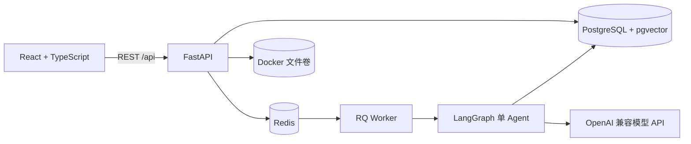

# JobPilot

一个本地优先、开源、免登录的岗位匹配与简历定向优化 Agent。

JobPilot 接收 PDF/DOCX 简历和岗位 JD，通过岗位知识规则、简历原文证据与 LangGraph 工作流，生成可解释的匹配评分、能力缺口、面试准备建议和事实受限的简历优化草稿。

> 当前版本面向“每位使用者在自己的电脑运行 Docker”的单机私密工作区。不同电脑拥有各自的数据库、文件和模型配置，互不影响。请勿在未增加匿名工作区隔离前，将当前单工作区模式直接部署为多人共享的公网服务。

## 核心特点

- **免登录、本地优先**：打开本机页面即可使用，简历和报告保存在本机 Docker Volume 中。
- **证据驱动评分**：每个得分项必须关联可定位的简历原文，LLM 不直接决定分数。
- **跨岗位适配**：明确命中已发布岗位模型时使用专业规则，否则进入 JD 自适应评分。
- **硬门槛机制**：缺失必需能力时按确定性规则封顶，并展示封顶原因。
- **事实受限优化**：只能重组、压缩和突出已有事实，不允许虚构经历、技能、公司、学历或数据。
- **可审计 Agent**：报告展示解析、检索、验证、评分和建议生成轨迹。
- **知识包版本化**：岗位规则支持草稿、校验、发布和历史版本回滚。
- **异步任务处理**：Redis + RQ Worker 执行耗时分析，页面轮询任务状态。
- **可导出报告**：支持 PDF 打印导出与 Markdown 报告。

## 产品流程

```text
上传 PDF / DOCX 简历
        ↓
粘贴目标岗位 JD
        ↓
选择自动识别或已发布岗位模型
        ↓
简历事实提取 → JD 结构化 → 技能标准化
        ↓
向量/关键词混合检索 → 原文证据验证
        ↓
确定性评分 → 缺口说明 → 面试建议
        ↓
生成岗位定向优化草稿
        ↓
逐项接受/拒绝 → 发布新的简历版本
```

## 技术架构



| 层级 | 技术 |
|---|---|
| 前端 | React 18、TypeScript、Vite、React Router、TanStack Query、Motion、Remotion |
| 后端 | Python 3.12、FastAPI、Pydantic、SQLAlchemy、Alembic |
| Agent | LangGraph、LangChain、结构化输出、确定性评分规则 |
| 数据 | PostgreSQL 16、pgvector、Redis、Docker Volume |
| 任务 | RQ Worker、有限重试、任务状态与执行轨迹 |
| 工程 | Docker Compose、Pytest、GitHub Actions |

## 快速开始

### 环境要求

- Windows、macOS 或 Linux
- Docker Desktop，或 Docker Engine + Docker Compose
- 一个 OpenAI 兼容模型供应商的 API Key（可选，但建议配置）

使用 Docker 运行时，不需要在宿主机安装 Node.js、Python、PostgreSQL 或 Redis。

### 1. 获取项目

```bash
git clone https://github.com/jammick/jobpilot.git
cd jobpilot
```

### 2. 创建本地配置

Windows PowerShell：

```powershell
Copy-Item .env.example .env
```

macOS / Linux：

```bash
cp .env.example .env
```

`.env` 只保存在本机，已被 `.gitignore` 排除。不要将真实 API Key、数据库密码或管理密钥提交到 GitHub。

至少替换以下占位值：

```env
JWT_SECRET=请替换为高强度随机字符串
POSTGRES_PASSWORD=请替换为高强度随机数据库密码
KNOWLEDGE_ADMIN_KEY=请替换为高强度随机管理密钥
LOCAL_WORKSPACE_MODE=true
```

### 3. 启动服务

```bash
docker compose up -d --build
```

首次构建需要下载基础镜像和依赖，耗时取决于网络环境。构建完成后访问：

| 地址 | 用途 |
|---|---|
| <http://localhost:5173> | JobPilot 产品页面 |
| <http://localhost:8000/health> | 后端健康检查 |
| <http://localhost:8000/docs> | FastAPI 交互式 API 文档 |
| <http://localhost:5173/developer> | 本地开发者控制台 |

检查服务状态：

```bash
docker compose ps
```

查看分析任务日志：

```bash
docker compose logs -f backend worker
```

### 4. 配置模型

普通使用者在产品的“模型设置”页面填写 Chat LLM：

- 供应商/Base URL
- Chat 模型名称
- API Key

API Key 会加密保存在本机 PostgreSQL 中，接口只返回脱敏提示，不会把完整 Key 返回浏览器。只要数据库 Volume 未删除，Docker 重启后配置仍然存在。

然后依次完成：

1. 在“简历库”导入一份 PDF 或 DOCX 简历。
2. 在“新建匹配”粘贴岗位 JD。
3. 选择“自动识别最合适的评分方式”或指定岗位模型。
4. 点击“开始匹配”，等待 Agent 报告。
5. 查看证据、评分、缺口和 Agent 轨迹。
6. 按需生成岗位定向优化草稿并确认修改。

## 模型配置与优先级

JobPilot 将 Chat LLM 与嵌入模型分为两个职责域。

### Chat LLM

用于：

- JD 结构化解析
- 报告总结与求职建议
- 面试问题生成
- 岗位定向简历优化草稿

当前优先级：

```text
页面保存的模型配置
        ↓ 不存在或没有可用 Key
.env 中的 OPENAI_API_KEY / OPENAI_BASE_URL / CHAT_MODEL
```

页面配置保存在 `user_model_configs` 表中，不会修改 `.env`。为避免供应商混用，页面配置时应同时填写正确的 Base URL、模型名称和对应 API Key。

### 嵌入模型

用于：

- 简历文本向量化
- 岗位知识文档向量化
- pgvector 语义检索

嵌入配置只由开发者通过 `.env` 管理：

```env
OPENAI_API_KEY=
OPENAI_BASE_URL=
EMBEDDING_MODEL=text-embedding-3-small
EMBEDDING_DIMENSION=1536
```

当前实现中 Chat LLM 的系统兜底与嵌入模型共用 `OPENAI_API_KEY` 和 `OPENAI_BASE_URL`。页面模型配置只覆盖 Chat LLM，不会改变嵌入模型。

如果不配置系统 API Key：

- 简历上传、历史记录和规则评分仍可工作；
- 向量检索会降级为关键词检索；
- 依赖 LLM 的结构化解析、建议或优化可能进入降级模式或给出配置提示。

`EMBEDDING_DIMENSION` 必须与嵌入供应商实际返回的向量维度一致，否则向量不会写入数据库。

## Agent 如何评分

JobPilot 不是让 LLM“凭感觉打分”。评分流程为：

1. 从简历中提取技能、岗位、学历、组织、经验年限和量化成果等事实。
2. 每条事实记录原文引用、字符位置、证据强度和提取器版本。
3. 从 JD 提取必需能力、优先能力、职责、经验和学历要求。
4. 使用同义词本体、关键词与向量检索寻找候选证据。
5. 验证证据能否精确回链到简历原文。
6. 对每项要求标记 `matched`、`partial` 或 `unmatched`。
7. 由固定权重和硬门槛规则计算最终分数。
8. LLM 只负责解释结果，不直接修改规则分数。

同一份简历、JD 和知识版本重复执行时，规则评分应保持一致。

当 JD 无法可靠匹配已发布的专业岗位模型时，系统会进入 **JD 自适应模式**，根据当前 JD 动态建立技能、职责、经验和学历评分项，不会把 AI 产品经理的技术要求套用到其他岗位。

## 岗位知识包

知识包由开发者维护，普通使用者无需接触。项目提供两个 AI 产品经理示例：

```text
backend/app/seed/ai-product-manager-v1.json
backend/app/seed/ai-product-manager-v2.json
```

知识包包括：

- `skills`：标准技能、分类与同义词；
- `rules`：能力维度、权重、硬门槛与关联技能；
- `version`：用于分析复现和版本审计；
- `sources`：数据来源、许可证和编审说明；
- 参考文档：可选 PDF、DOCX、Markdown 或 TXT，只参与检索，不直接决定分数。

规则权重必须合计 100，并至少包含一个硬门槛。导入后的知识包默认为 `draft`，草稿不会参与正式分析，只有发布后的版本才会生效。

### 导入知识包

在 `.env` 配置 `KNOWLEDGE_ADMIN_KEY` 后执行：

```powershell
$adminKey = "你的 KNOWLEDGE_ADMIN_KEY"
$manifest = "backend/app/seed/ai-product-manager-v2.json"

$response = curl.exe -s -X POST "http://localhost:8000/api/knowledge-bases/import" `
  -H "X-Knowledge-Admin-Key: $adminKey" `
  -F "manifest=@$manifest"

$response
```

响应中的 `id` 是知识包 ID。校验与发布：

```powershell
$baseId = "替换为知识包 ID"

curl.exe -X POST "http://localhost:8000/api/knowledge-bases/$baseId/validate" `
  -H "X-Knowledge-Admin-Key: $adminKey"

curl.exe -X POST "http://localhost:8000/api/knowledge-bases/$baseId/publish" `
  -H "X-Knowledge-Admin-Key: $adminKey"
```

也可以打开 <http://localhost:8000/docs>，在 Swagger UI 中调用知识库接口。

## 数据与隐私

默认本地模式下，数据分别保存在 Docker Volume：

| Volume | 内容 |
|---|---|
| `postgres_data` | 用户工作区、简历文本、向量、报告、知识包和模型配置 |
| `redis_data` | 待处理任务和任务结果缓存 |
| `uploads` | 原始 PDF/DOCX 文件 |

删除简历时，服务端会同步删除关联分析数据、文本片段、向量记录和物理文件。

停止容器不会删除数据：

```bash
docker compose down
```

以下命令会删除数据库、任务和上传文件，请谨慎使用：

```bash
docker compose down -v
```

模型调用会将当前任务需要的 JD 或简历证据发送给使用者配置的模型供应商。使用者应阅读对应供应商的数据处理与隐私政策，不要在不可信的第三方接口中提交敏感简历。

## 开发者运行

### 后端

```powershell
cd backend
python -m venv .venv
.\.venv\Scripts\Activate.ps1
python -m pip install -r requirements.txt
alembic upgrade head
uvicorn app.main:app --reload --port 8000
```

macOS / Linux 激活虚拟环境：

```bash
source .venv/bin/activate
```

直接运行后端时，可将 `TASK_MODE=inline` 用于轻量调试；Docker Compose 会覆盖为 `queue` 并交给 RQ Worker 执行。

### 前端

```bash
cd frontend
npm ci
npm run dev
```

生产构建：

```bash
npm run build
```

前端通过 `VITE_API_URL` 设置 API 地址。Docker 镜像默认使用同源路径 `/api`。不要把任何密钥放进以 `VITE_` 开头的环境变量，因为这些值会进入浏览器构建产物。

## 测试与 Agent 评测

后端单元测试：

```powershell
cd backend
python -m pytest tests -q
```

确定性 Agent 评测：

```powershell
cd backend
python -m evals.runner
python -m evals.runner --json
```

评测覆盖：

- 规则分数准确性；
- `matched / partial / unmatched` 状态；
- 原文证据有效性；
- 重复执行一致性；
- 硬门槛封顶；
- 技能同义词；
- 关键词堆砌；
- 提示词注入；
- 优化草稿防虚构检查。

前端类型检查和生产构建：

```bash
cd frontend
npm run lint
npm run build
```

GitHub Actions 会在 Push 和 Pull Request 时运行后端测试、Agent 评测、前端类型检查与构建。

## 主要页面

| 路径 | 功能 |
|---|---|
| `/` | 产品首页 |
| `/resumes` | 简历导入、管理和批量上传 |
| `/new` | 创建岗位匹配分析 |
| `/history` | 分析档案与删除操作 |
| `/analysis/:id` | PDF 预览、评分报告、证据和定向优化 |
| `/settings` | 使用者 Chat LLM 配置 |
| `/developer` | 开发者知识库、评测和可观测性控制台 |

## 主要 API

所有业务接口以 `/api` 为前缀，完整请求与响应结构请查看 <http://localhost:8000/docs>。

| 分类 | 代表接口 |
|---|---|
| 模型设置 | `GET /api/settings/model`、`PUT /api/settings/model` |
| 简历 | `POST /api/resumes/batch`、`GET /api/resumes`、`DELETE /api/resumes/{id}` |
| 分析 | `POST /api/analyses`、`GET /api/analyses/{id}`、`POST /api/analyses/{id}/retry` |
| 报告 | `GET /api/analyses/{id}/trace`、`GET /api/analyses/{id}/export` |
| 优化 | `POST /api/resumes/{id}/optimizations`、修改决策、发布新版本 |
| 知识库 | 导入、校验、发布、回滚、检索和向量状态检查 |
| 评测 | 开发者观测指标与回归评测接口 |

知识库和开发者接口需要请求头：

```http
X-Knowledge-Admin-Key: <KNOWLEDGE_ADMIN_KEY>
```

## 常见问题

### 页面无法打开

```bash
docker compose ps
docker compose logs --tail 100 frontend backend
```

确认 frontend 与 backend 均为 `healthy`。

### 分析一直排队或失败

```bash
docker compose ps
docker compose logs --tail 150 worker redis backend
```

确认 Redis 健康、Worker 正在运行，并检查模型 Base URL、模型名和 API Key 是否属于同一供应商。

### 可以上传简历，但没有语义检索

检查 `.env` 中的系统 API Key、嵌入模型名称和向量维度。嵌入失败时系统会保留文件并退化为关键词检索。

### PDF 无法解析

MVP 仅支持包含可提取文本的 PDF。扫描版 PDF、图片简历和加密 PDF 暂不支持 OCR。

### 页面模型配置重启后消失或不可用

页面配置保存在 PostgreSQL 中。不要删除 `postgres_data` Volume；同时避免随意更换 `JWT_SECRET`，因为它参与当前页面 API Key 的加密派生，变化后旧 Key 将无法解密。

### 修改代码后页面没有变化

```bash
docker compose up -d --build frontend backend worker
```

然后刷新浏览器缓存。

## 项目结构

```text
.
├── backend/
│   ├── alembic/              # 数据库迁移
│   ├── app/
│   │   ├── api/              # FastAPI 路由与依赖
│   │   ├── core/             # 配置、数据库与安全
│   │   ├── schemas/          # Pydantic 接口契约
│   │   ├── seed/             # 示例岗位知识包
│   │   └── services/         # Agent、评分、检索、任务和优化
│   ├── evals/                # Agent 回归与影子数据评测
│   └── tests/                # 后端测试
├── frontend/
│   └── src/                  # React 页面、API 客户端与样式
├── postgres/                 # PostgreSQL + pgvector 镜像
├── .github/workflows/        # CI
├── docker-compose.yml
└── .env.example
```

## 当前边界

- 当前发布模式是单机、单私密工作区，不是多用户 SaaS。
- 扫描版 PDF 和图片简历暂不支持 OCR。
- 专业岗位评分质量依赖开发者发布的岗位知识包。
- 通用岗位使用 JD 自适应规则，适合辅助判断，不应被用于自动招聘决策。
- 优化结果是岗位匹配建议，不保证获得面试或录用。
- 公网免登录体验版需要先增加匿名设备工作区、数据过期、限流与隐私删除机制。

## Roadmap

- 公网匿名工作区隔离；
- Chat LLM 与嵌入模型使用独立服务端密钥；
- 本地开源嵌入模型；
- OCR 与图片简历解析；
- 更多岗位知识包；
- 自动备份和恢复工具；
- 完整端到端浏览器测试。

## 贡献

欢迎提交 Issue 和 Pull Request。提交代码前请运行：

```bash
cd backend && python -m pytest tests -q && python -m evals.runner
cd ../frontend && npm run lint && npm run build
```

新增岗位知识包时，请同时提供：

- 数据来源和许可证；
- 技能与同义词；
- 评分维度和权重依据；
- 硬门槛说明；
- 对应回归测试；
- 不包含真实个人简历的示例数据。

## 开源许可

仓库正式公开前，请在根目录添加明确的 `LICENSE` 文件。如果希望他人能够自由使用、修改和分发，同时保留版权声明，可考虑使用 MIT License；最终协议由项目所有者决定。
