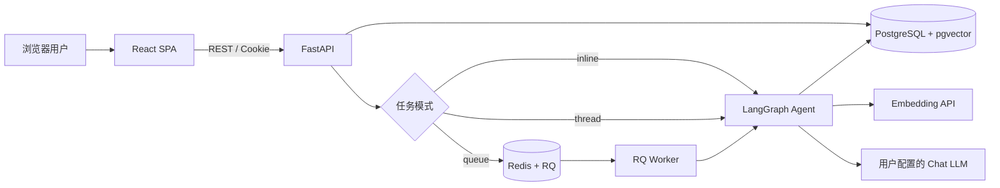
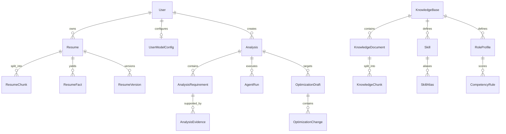
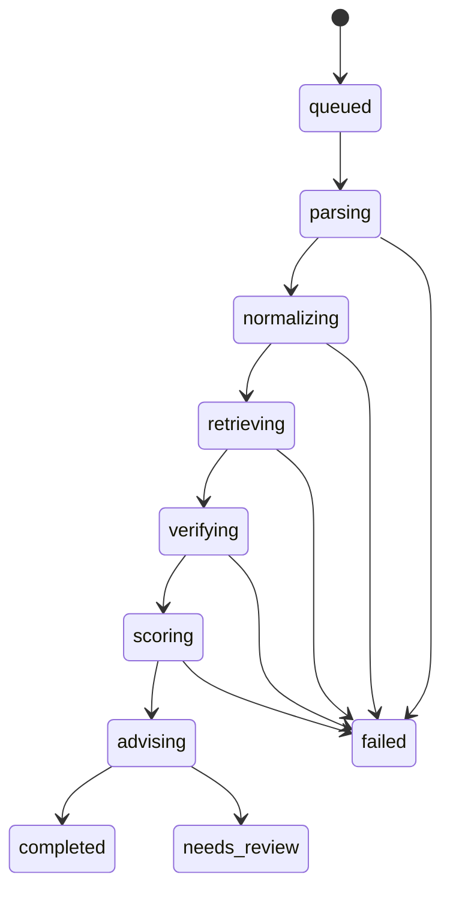

# JobPilot 项目架构与学习手册

> 本文面向项目维护者、学习者和面试复盘场景，基于 2026-09-15 的代码状态整理。当前评分引擎版本为 `evidence-v2`。

## 1. 项目定位

JobPilot 是一个开源、前后端分离、证据驱动的求职分析 Agent。用户上传 PDF 或 DOCX 简历并填写岗位 JD 后，系统会输出：

- 岗位匹配总分与维度分；
- 每项要求的匹配状态；
- 可以定位回简历原文的证据；
- 硬门槛缺失与评分封顶原因；
- 针对岗位的简历改写建议；
- 面试准备问题；
- 可确认、拒绝和发布的简历优化版本。

项目不是一个“让大模型凭感觉打分”的聊天机器人。它采用：

```text
确定性流程编排 + 规则评分 + 事实证据 + LLM 结构化理解与表达
```

核心目标是可解释、可复现、可追溯：同一份简历、同一份 JD 和同一版本知识规则重复执行时，规则得分应保持一致。

## 2. 产品设计原则

### 2.1 LLM 不直接决定分数

LLM 可以参与 JD 结构化解析、建议生成和简历改写，但最终分数由 Python 规则计算。这样可以减少：

- 不同模型导致分数漂移；
- 同一模型多次执行结果不同；
- 模型受到提示词注入影响；
- 模型在缺少证据时虚构候选人能力。

### 2.2 检索不等于证明

向量相似度只说明“这段内容可能相关”，不能证明候选人满足岗位要求。因此系统将 RAG 拆成两步：

1. 检索：召回可能相关的简历切片和知识切片；
2. 验证：检查是否存在具体、精确、可回链的原文证据。

`evidence-v2` 中，通用职责判断必须包含岗位要求的具体词语。只出现“产品、项目、数据”等宽泛词时，最多只能得到部分匹配。

### 2.3 优化不能虚构

简历优化只能执行：

- 重排已有经历；
- 压缩冗余表达；
- 澄清职责；
- 突出与 JD 有关的已有事实；
- 调整信息优先级。

不得新增原简历不存在的公司、岗位、技能、项目、时间、学历、数字或成果。

### 2.4 用户只使用产品，知识规则由开发者维护

普通用户可以上传简历、分析岗位和配置自己的 Chat LLM。岗位知识包、嵌入模型和评测工具属于开发者能力，通过 `/developer` 和服务端环境变量管理。

## 3. 系统总体架构



架构分为五个主要职责域：

| 职责域 | 主要技术 | 作用 |
|---|---|---|
| 产品界面 | React、TypeScript、Vite | 页面路由、表单、轮询、报告展示、PDF 打印 |
| API | FastAPI、Pydantic | 输入校验、权限、资源接口、异常响应 |
| Agent | LangGraph、LangChain | 固定状态机、模型调用、提示词、结构化输出 |
| 数据 | PostgreSQL、SQLAlchemy、pgvector | 业务数据、简历原文、证据、向量和版本持久化 |
| 异步任务 | RQ/Redis 或线程执行器 | 避免长时间分析阻塞 HTTP 请求 |

## 4. 技术栈

### 4.1 前端

| 技术 | 版本/用途 |
|---|---|
| React | 18.3，组件与页面渲染 |
| TypeScript | 静态类型检查 |
| Vite | 开发服务器与生产构建 |
| React Router | SPA 页面路由 |
| TanStack Query | API 缓存、加载状态、轮询和失效刷新 |
| Axios | REST 请求，统一携带 Cookie |
| Motion | 页面微交互和转场 |
| Remotion Player | 首页产品动效 |
| CSS | 自定义视觉系统、响应式和打印样式 |

前端入口主要位于：

- `frontend/src/main.tsx`：页面、路由、主要组件；
- `frontend/src/api.ts`：DTO 类型和 API 客户端；
- `frontend/src/styles.css`：全局视觉样式与打印样式；
- `frontend/src/HeroMotion.tsx`：首页动效；
- `frontend/vite.config.ts`：Vite 配置。

### 4.2 后端

| 技术 | 用途 |
|---|---|
| Python 3.12 | Render/Docker 运行时 |
| FastAPI | REST API 与 OpenAPI 文档 |
| Pydantic | 请求、响应和 LLM JSON 校验 |
| SQLAlchemy 2 | ORM 与事务管理 |
| Alembic | 数据库迁移 |
| PostgreSQL 16 | 关系数据与文件字节持久化 |
| pgvector | 简历、知识文档的向量字段 |
| LangChain | Prompt、ChatOpenAI、解析器和切分器 |
| LangGraph | 单 Agent 固定状态机 |
| pypdf | PDF 文本提取 |
| python-docx | DOCX 文本提取 |
| RQ + Redis | 本地 Docker 异步任务队列 |
| cryptography/Fernet | 用户 Chat LLM Key 加密存储 |
| PyJWT | 登录令牌和匿名工作区 Cookie 签名 |

## 5. 仓库结构

```text
jobpilot/
├── frontend/
│   ├── src/
│   │   ├── main.tsx
│   │   ├── api.ts
│   │   ├── styles.css
│   │   └── HeroMotion.tsx
│   ├── Dockerfile
│   ├── nginx.conf
│   └── package.json
├── backend/
│   ├── app/
│   │   ├── api/
│   │   │   ├── deps.py
│   │   │   └── routes.py
│   │   ├── core/
│   │   │   ├── config.py
│   │   │   ├── database.py
│   │   │   └── security.py
│   │   ├── services/
│   │   │   ├── analysis.py
│   │   │   ├── facts.py
│   │   │   ├── scoring.py
│   │   │   ├── knowledge.py
│   │   │   ├── optimization.py
│   │   │   ├── documents.py
│   │   │   ├── model_config.py
│   │   │   └── tasks.py
│   │   ├── schemas/contracts.py
│   │   ├── seed/
│   │   ├── main.py
│   │   └── models.py
│   ├── alembic/
│   ├── evals/
│   ├── tests/
│   ├── Dockerfile
│   └── entrypoint.sh
├── postgres/Dockerfile
├── docker-compose.yml
├── Dockerfile
├── render.yaml
├── .env.example
├── README.md
└── jobpilot.md
```

## 6. 前端架构与交互

### 6.1 页面路由

| 路径 | 页面职责 |
|---|---|
| `/` | 无侧栏的产品首页 |
| `/resumes` | 简历库、批量上传、删除 |
| `/new` | 选择简历、填写 JD、创建分析 |
| `/history` | 分析历史、状态和删除 |
| `/analysis/:id` | PDF/文本预览、评分报告、优化工作台 |
| `/settings` | 当前工作区 Chat LLM 配置 |
| `/developer` | 开发者知识库、向量状态、评测和可观测性 |

### 6.2 数据请求

`frontend/src/api.ts` 创建统一 Axios 实例：

```ts
export const api = axios.create({
  baseURL: import.meta.env.VITE_API_URL || "http://localhost:8000/api",
  withCredentials: true,
});
```

`withCredentials: true` 很关键：线上无登录模式通过 HttpOnly Cookie 识别匿名工作区，如果不携带 Cookie，每次请求都可能被识别成新用户。

TanStack Query 负责：

- 缓存简历和分析数据；
- 创建、删除后主动失效列表缓存；
- 分析未完成时每两秒轮询；
- 到达 `completed`、`needs_review` 或 `failed` 后停止轮询；
- 暴露 `isLoading`、`isPending` 和 `isError` 给界面。

### 6.3 分析综合页面

分析详情采用左右工作台：

- 左侧：原始 PDF iframe 或 DOCX 提取文本；
- 右侧：总分、维度分、JD 解析、简历事实、硬门槛、需求证据、建议、面试题和 Agent 时间线；
- 下部：岗位定向优化草稿与逐项确认。

浏览器打印模式通过给 `body` 添加不同 class，分别生成分析报告和优化简历 PDF。它不是后端重新排版 PDF，而是利用浏览器打印引擎保持页面样式。

## 7. 后端分层

### 7.1 `core`

- `config.py`：从 `.env` 和系统环境读取配置；
- `database.py`：创建 SQLAlchemy Engine、Session 和 Base；
- `security.py`：密码哈希、JWT 和匿名工作区 Token。

### 7.2 `api`

- `deps.py`：数据库依赖、当前用户解析、开发者密钥校验；
- `routes.py`：REST 路由和资源所有权检查。

路由层应保持轻量，主要做：

1. 校验输入；
2. 检查用户是否拥有资源；
3. 调用 service；
4. 返回 schema。

### 7.3 `services`

业务逻辑集中在 service 层：

- 文档处理；
- 知识库导入与向量化；
- Agent 流程；
- 确定性评分；
- 优化事实防线；
- 异步任务调度；
- 模型配置加解密。

### 7.4 `schemas`

Pydantic schema 同时约束：

- 外部 API 输入；
- API 输出；
- 知识包 Manifest；
- LLM 返回的结构化 JSON。

## 8. 数据模型



关键表说明：

| 表 | 关键内容 |
|---|---|
| `users` | 本地用户、匿名工作区用户、过期时间 |
| `user_model_configs` | 加密后的用户 Chat API Key、Base URL、模型名 |
| `resumes` | 文件元数据、提取文本、原始文件字节 |
| `resume_chunks` | 简历切片与 embedding |
| `resume_facts` | 技能、学历、年限、岗位、组织、量化成果及原文位置 |
| `analyses` | JD、任务状态、最终报告 JSON、使用的岗位模型 |
| `analysis_requirements` | 每项岗位要求、权重、硬门槛和状态 |
| `analysis_evidence` | 原文引用、切片、字符位置、验证结果 |
| `agent_runs` | 节点轨迹、耗时、模型 token、错误码 |
| `knowledge_bases` | 知识包 Manifest、岗位、版本、发布状态、嵌入模型 |
| `skills` / `skill_aliases` | 标准技能与同义词映射 |
| `role_profiles` / `competency_rules` | 岗位能力模型、维度权重和硬门槛 |
| `optimization_drafts` | 定向优化草稿 |
| `optimization_changes` | 原文、建议、理由、证据和用户决定 |
| `resume_versions` | 用户确认后生成的新版本，不覆盖原简历 |

## 9. 简历上传与索引流程

```text
UploadFile
  → 扩展名白名单
  → 文件大小校验
  → PDF/DOCX 文本提取
  → 最小文本长度校验
  → UUID 物理文件名
  → resumes 保存文本和原始字节
  → RecursiveCharacterTextSplitter 切片
  → Embedding API
  → resume_chunks + pgvector
```

约束：

- 简历仅支持 PDF 和 DOCX；
- 默认最大 8 MB；
- 单次批量上传 1～10 份；
- 扫描版 PDF 没有文本层，当前不支持 OCR；
- 文件名由服务器生成 UUID，避免路径穿越和重名覆盖。

为什么同时存物理文件和数据库字节：

- 本地 Docker 通过 volume 保存文件，读取速度直接；
- Render 免费实例文件系统可能在重启后丢失；
- `Resume.file_data` 保证云端重启后仍可预览原文件。

## 10. Agent 范式

JobPilot 使用的是：

```text
单 Agent + LangGraph 固定状态机 + 工具化节点
```

它不是：

- 多 Agent 角色讨论；
- 开放式 ReAct 无限循环；
- 让模型自由决定下一步工具；
- 纯聊天式工作流。

固定流程更适合评分产品，因为执行路径清晰、便于测试、成本可控、容易复现。

### 10.1 LangGraph 状态

`AgentState` 维护整个运行期间的数据，例如：

- 数据库 Session；
- 当前用户、简历和分析；
- 岗位模型和知识版本；
- 技能别名；
- JD 结构化结果；
- 简历事实；
- requirements 和 evidence；
- score 和 advice；
- trace 和模型调用 metrics。

### 10.2 节点顺序



各节点职责：

1. `parsing`：确认简历文本和 JD 满足最小条件；
2. `normalizing`：选择岗位能力模型、解析 JD、标准化技能、提取简历事实；
3. `retrieving`：按要求召回简历证据和知识上下文；
4. `verifying`：验证引用字符位置与原文完全一致；
5. `scoring`：根据匹配状态、权重和硬门槛计算分数；
6. `advising`：让 LLM 基于已经确定的分数和证据生成表达建议。

## 11. JD 解析机制

JD 解析采用“规则兜底 + LLM 增强”：

```text
规则解析结果 ─┐
              ├─ 合并 → 最终 JDProfile
LLM JSON 结果 ─┘
```

输出字段：

- `title`：岗位名称；
- `required_skills`：必需技能；
- `preferred_skills`：加分技能；
- `responsibilities`：岗位职责；
- `experience_years`：经验年限；
- `education`：学历；
- `keywords`：其他关键词。

LLM 结果不能覆盖规则已经明确找到的要求。`evidence-v2` 会合并两者，避免 LLM 只返回一两个要求后仍将分数归一化成 100。

输入 JD 中试图改变系统任务的文字会被当作数据，Prompt 明确要求模型只提取岗位事实。

## 12. 岗位模型路由

系统支持两种评分模式。

### 12.1 专业岗位模型 `role_profile`

如果 JD 被识别为已发布知识包覆盖的岗位，系统使用该岗位的技能本体、权重和硬门槛。目前示例重点覆盖 AI 产品经理。

AI 产品经理默认维度：

| 维度 | 权重 | 硬门槛 |
|---|---:|---|
| 产品策略与需求洞察 | 25% | 是 |
| LLM/RAG 与 AI 技术理解 | 25% | 是 |
| 产品交付与跨团队协作 | 20% | 否 |
| 项目成果与量化意识 | 15% | 否 |
| 用户与商业理解 | 10% | 否 |
| 教育与补充资格 | 5% | 否 |

### 12.2 通用 JD 自适应模型 `jd_adaptive`

其他岗位不会套用 AI 产品经理标准，而是从当前 JD 动态生成评分项。基础权重为：

| 分组 | 基础权重 |
|---|---:|
| 核心技能 | 50 |
| 加分技能 | 10 |
| 职责与场景 | 25 |
| 经验要求 | 10 |
| 学历与资格 | 5 |

没有出现的分组不会建立空评分项，活跃分组最终归一化到 100。JD 的必需技能、明确经验和学历会被标记为硬门槛。

## 13. 简历事实提取

`facts.py` 使用确定性规则从简历切片提取：

- 标准技能及其别名；
- 学历；
- 岗位名称；
- 公司、集团、大学或学院；
- 工作年限；
- 任职时间段；
- 带行动和数字结果的量化成果。

每条事实都保存：

```python
{
    "fact_type": "skill",
    "value": "RAG",
    "source_chunk_id": "...",
    "source_quote": "基于 LangChain 搭建知识库问答系统。",
    "char_start": 120,
    "char_end": 146,
    "strength": "strong"
}
```

证据强度大致分为：

- `strong`：包含“负责、设计、搭建、实现、推动”等行动表达；
- `weak`：只是了解、熟悉或没有明确行动；
- `mentioned`：只出现在关键词/技能清单中。

## 14. RAG 在项目中的作用

RAG 由以下部分组成：

1. 文本切分：简历和知识文档默认 700 字符、100 字符重叠；
2. 向量化：调用开发者配置的 OpenAI 兼容 Embedding API；
3. 存储：embedding 写入 pgvector；
4. 混合召回：关键词命中和余弦相似度共同排序；
5. 证据验证：候选句必须定位回原文。

必须牢记：

```text
知识文档用于解释和检索补充，不直接决定分数。
向量相似度用于候选召回，不直接等于 matched。
```

因此 JobPilot 不一定需要 RAGFlow。RAGFlow 更适合复杂文档知识问答、可视化数据集管理和多解析器场景；JobPilot 的核心是结构化岗位规则、用户隔离和证据评分，自有轻量检索链更容易控制评分边界。

## 15. 证据验证

`verifying` 节点检查：

```python
chunk.content[char_start:char_end] == quote
```

只有位置合法且字符串完全一致，证据才会保留。没有有效证据时，对应 requirement 会被改成 `unmatched`。

这条约束解决了一个重要问题：LLM 或检索器即使生成了一段“看起来合理”的引用，只要无法在原文精确定位，就不能计分。

## 16. 评分机制

### 16.1 三态评分

```text
matched   = 1.0
partial   = 0.5
unmatched = 0.0
```

设第 `i` 项权重为 `wᵢ`，状态系数为 `sᵢ`：

```text
原始得分 = Σ(wᵢ × sᵢ) / Σ(wᵢ) × 100
```

如果知识包权重本身总和已经是 100，可以直接理解为：

```text
原始得分 = Σ(wᵢ × sᵢ)
```

### 16.2 硬门槛

```text
缺失 0 项硬门槛：最高 100
缺失 1 项硬门槛：总分封顶 59
缺失 2 项及以上：总分封顶 39
```

最终得分：

```text
total = min(raw_total, hard_gate_cap)
```

### 16.3 证据覆盖率

前端原先称其为“信心”，现在显示为“证据覆盖”。它不是统计学概率，而是有有效证据支持的要求权重比例。

### 16.4 为什么以前容易全部 100

早期实现把整个简历切片的向量相似度应用到切片里的每个句子。只要切片整体与 JD 相似，带“负责、推动”等词的普通句子也可能满足多个职责。

`evidence-v2` 修复为：

- 向量相似只排序候选切片；
- 证据句必须存在具体岗位词锚点；
- 仅命中宽泛词最多部分匹配；
- 通用 JD 的必需技能、经验和学历启用硬门槛；
- LLM 解析结果与规则结果合并。

100 分仍然允许，但必须所有计分要求都有强证据，而不是“文本看起来相似”。

## 17. 建议生成

评分完成后才进入 `advising`。LLM 接收：

- 岗位名称；
- 已经确定的规则得分；
- 每项要求状态；
- 简历证据。

LLM 只负责生成：

- `summary`；
- `improvements`；
- `interview_questions`。

如果用户没有配置 Chat LLM，系统仍能输出规则评分，并使用本地模板生成基础建议；报告进入 `needs_review` 或显示配置提示，而不是让整个服务崩溃。

## 18. 岗位定向简历优化

### 18.1 输入

优化必须关联一份已经完成的分析，不能脱离 JD 做通用润色。

### 18.2 LLM 输出结构

每个修改项包含：

```json
{
  "title": "突出检索项目经验",
  "original_text": "参与知识库项目。",
  "suggested_text": "参与知识库项目，重点负责检索链路的需求梳理。",
  "rationale": "对应 JD 的 RAG 产品经验要求。",
  "evidence_quote": "参与知识库项目。"
}
```

### 18.3 确定性事实防线

`optimization_change_violations` 会拦截：

- 原文不存在；
- 证据不存在；
- 新增数字；
- 新增英文技术术语；
- 新增公司、学校或职位等命名事实；
- 新增知识包技能；
- 优化前后完全相同；
- 只修改空格或标点。

如果第一轮所有修改都被拦截，系统会将失败原因反馈给模型并自动重试一次。

优化预览不是直接使用模型生成的自由整篇文本，而是从原简历开始，仅应用通过事实校验的 change。

### 18.4 用户确认与发布

每条 change 初始状态为 `pending`。用户必须逐条选择：

- `accepted`：接受修改；
- `rejected`：保留原文。

全部确认后才能发布。发布时从原始简历重新应用已接受项，生成新的 `resume_version`，绝不覆盖原始文件。

## 19. 知识包

知识包由 Manifest 和可选参考文档组成。

Manifest 可以使用 JSON 或 YAML，主要字段：

```yaml
name: 岗位能力模型名称
role_key: ai_product_manager
version: 2.0.0
role_name: AI 产品经理
skills:
  - name: RAG
    aliases: [检索增强生成, LangChain, 知识库问答]
    category: ai
rules:
  - key: ai_literacy
    name: LLM/RAG 与 AI 技术理解
    weight: 25
    required: true
    skills: [RAG, 大语言模型应用]
```

导入流程：

```text
上传 Manifest/参考资料
  → Pydantic 结构校验
  → 技能/别名/规则引用校验
  → draft
  → 文档切分和向量化
  → 开发者预览与搜索
  → published
```

同一 `role_key` 只保留一个 published 版本。发布新版本时，旧版本变为 archived；历史分析仍保存当时使用的岗位模型 ID，重试时可以继续使用旧规则，保证可复现。

## 20. Chat LLM 与 Embedding 配置

这是项目中最容易混淆的两个模型。

### 20.1 Chat LLM

用于：

- JD 结构化解析；
- 报告建议；
- 面试问题；
- 岗位定向简历优化。

普通用户可以在 `/settings` 配置 Base URL、模型名和 API Key。Key 使用 Fernet 加密后存入 `user_model_configs`，接口只返回类似 `••••••••1234` 的掩码提示。

配置优先级：

```text
当前工作区已保存配置 → 完整使用该行配置
当前工作区没有配置   → 回退到服务端 OPENAI_* 和 CHAT_MODEL
```

一旦工作区存在配置行，不会把用户选择的 Base URL 与开发者的系统 Key 混用。

### 20.2 Embedding 模型

用于：

- 简历向量；
- 知识文档向量；
- pgvector 检索。

它只能由开发者通过环境变量配置。Render 当前默认：

```env
EMBEDDING_BASE_URL=https://dashscope.aliyuncs.com/compatible-mode/v1
EMBEDDING_MODEL=text-embedding-v2
EMBEDDING_DIMENSION=1536
```

API Key 不写在仓库中，而是在 Render 环境变量 `EMBEDDING_API_KEY` 中填写。

向量维度必须与数据库列维度一致。更换不同维度模型时，不能只改模型名，还需要迁移向量列并重新构建全部向量。

## 21. 匿名工作区与用户隔离

项目支持三种身份模式：

| 模式 | 配置 | 使用场景 |
|---|---|---|
| 本地单工作区 | `LOCAL_WORKSPACE_MODE=true` | 个人 Docker 演示 |
| 线上匿名隔离 | `LOCAL_WORKSPACE_MODE=false` + `ANONYMOUS_WORKSPACE_MODE=true` | 当前 Render 开源体验 |
| JWT 账号 | 两者都为 false | 未来账号制部署 |

匿名模式流程：

```text
首次请求
  → 没有有效 Cookie
  → 创建匿名 User
  → JWT 签名 workspace token
  → Set-Cookie: HttpOnly + Secure + SameSite=Lax
  → 后续请求解析为同一 user_id
```

所有用户资源查询都必须同时带 `user_id`：

```python
db.query(Resume).filter_by(id=resume_id, user_id=user.id).first()
```

隔离边界是浏览器 Cookie，因此：

- 不同电脑互不影响；
- 不同浏览器互不影响；
- 普通窗口和无痕窗口互不影响；
- 清除 Cookie 后将失去原工作区入口；
- 当前匿名工作区默认 30 天过期。

知识库是开发者维护的全局产品资源，不属于普通匿名用户；普通用户只读取已发布岗位模型。

## 22. 异步任务

`tasks.py` 将 API 与任务执行方式解耦，支持三种模式：

### 22.1 `inline`

直接在 API 进程执行，适合单元调试，不适合长任务。

### 22.2 `thread`

使用单线程 `ThreadPoolExecutor`。Render 免费部署采用该模式，将前端、API 和后台任务放在一个 Web Service 内，避免额外付费 Worker。

缺点：服务重启时，尚未完成的线程任务可能丢失。

### 22.3 `queue`

使用 Redis + RQ。Docker Compose 本地完整架构采用该模式：API 入队，独立 Worker 执行。

任务领取通过原子更新实现：只有状态为 `queued` 的记录能变为 `running`，从而防止重复投递重复执行。

## 23. API 设计

主要接口：

### 工作区与模型

```text
GET    /api/workspace
DELETE /api/workspace
GET    /api/settings/model
PUT    /api/settings/model
```

### 简历

```text
POST   /api/resumes
POST   /api/resumes/batch
GET    /api/resumes
GET    /api/resumes/{id}
GET    /api/resumes/{id}/file
DELETE /api/resumes/{id}
GET    /api/resumes/{id}/versions
```

### 分析

```text
POST   /api/analyses
GET    /api/analyses
GET    /api/analyses/{id}
DELETE /api/analyses/{id}
POST   /api/analyses/{id}/retry
GET    /api/analyses/{id}/trace
GET    /api/analyses/{id}/export
```

### 优化

```text
POST   /api/resumes/{id}/optimizations
GET    /api/optimizations/{id}
POST   /api/optimizations/{id}/changes/{change_id}/decision
POST   /api/optimizations/{id}/publish
```

### 开发者知识中心

```text
GET    /api/developer/status
GET    /api/developer/observability
GET    /api/developer/evaluations
POST   /api/developer/evaluations
POST   /api/knowledge-bases/import
POST   /api/knowledge-bases/{id}/validate
POST   /api/knowledge-bases/{id}/publish
POST   /api/knowledge-bases/{id}/rollback
GET    /api/knowledge-bases/{id}/insights
POST   /api/knowledge-bases/{id}/search
```

开发者接口使用 `X-Knowledge-Admin-Key` 请求头保护。

FastAPI 自动生成：

- `/docs`：Swagger UI；
- `/openapi.json`：机器可读接口描述。

## 24. 可靠性与安全

### 24.1 文件安全

- 后缀白名单；
- 大小限制；
- UUID 存储文件名；
- 不将用户文件名直接作为磁盘路径；
- 扫描版和空文本给出明确错误。

### 24.2 数据隔离

- Resume、Analysis、OptimizationDraft 等查询带 `user_id`；
- Cookie 使用签名 Token，不能由前端伪造 user_id；
- API 不返回完整 Token；
- 开发者知识接口额外验证管理密钥。

### 24.3 密钥安全

- `.env` 被 Git 忽略；
- 用户 Chat Key 加密入库；
- 接口只返回 Key 尾号提示；
- Embedding Key 只存在于部署环境；
- 日志不记录完整简历、JD、Key 和模型原始响应。

### 24.4 异常与日志

FastAPI 中间件为每个请求生成 `X-Request-ID`，记录：

- method；
- path；
- status；
- duration；
- request ID。

AgentRun 额外记录节点轨迹、总耗时、模型调用次数、token 和错误码。

## 25. 数据库迁移

Alembic 迁移按版本演进：

1. `0001_initial`：初始业务表；
2. `0002_async_analysis_queue`：任务队列字段；
3. `0003_structured_resume_facts`：结构化事实、证据和优化版本；
4. `0004_agent_observability`：运行指标和评测；
5. `0005_user_model_configs`：用户模型配置；
6. `0006_anonymous_workspaces`：匿名工作区与原始文件字节。

容器启动时 `entrypoint.sh` 先运行：

```bash
alembic upgrade head
```

迁移成功后才启动 Uvicorn，避免新代码访问旧表结构。

## 26. 本地 Docker 架构

`docker compose up --build` 启动五个服务：

```text
frontend :5173 → Nginx + React
backend  :8000 → FastAPI
worker          → RQ Worker
redis           → 任务队列
postgres        → PostgreSQL + pgvector
```

本地数据卷：

- `postgres_data`：关系数据和向量；
- `redis_data`：Redis AOF；
- `uploads`：上传文件。

常用命令：

```bash
docker compose up --build
docker compose ps
docker compose logs -f backend worker
docker compose exec backend alembic current
docker compose down
```

`docker compose down` 不删除命名卷；`docker compose down -v` 会删除数据库等持久数据，应谨慎使用。

## 27. Render 部署架构

Render 使用根目录多阶段 `Dockerfile`：

```text
Node 构建阶段：npm ci → npm run build
                    ↓
Python 运行阶段：安装后端依赖 + 复制 dist
                    ↓
FastAPI 同源提供 /api、/health、React SPA
```

Render Blueprint 创建：

- 一个免费 Web Service；
- 一个免费 PostgreSQL；
- `TASK_MODE=thread`；
- `SERVE_FRONTEND=true`；
- `ANONYMOUS_WORKSPACE_MODE=true`；
- `WORKSPACE_COOKIE_SECURE=true`。

代码自动部署被关闭。推送 GitHub 后需要在 Render 使用：

```text
Manual Deploy → Deploy latest commit
```

免费方案边界：

- Web Service 闲置后休眠，首次请求可能冷启动；
- 免费数据库容量和生命周期有限；
- 单进程线程任务没有独立 Worker 的持久性；
- 适合开源演示和用户体验验证，不适合长期生产 SLA。

## 28. 测试与 Agent 评测

### 28.1 单元/集成测试

后端测试覆盖：

- 用户隔离；
- 上传格式和文件解析；
- JD 解析；
- 岗位路由；
- 硬门槛和评分；
- 证据字符位置；
- 向量维度；
- 优化事实边界；
- 匿名工作区；
- 任务调度与可观测性。

运行：

```bash
cd backend
pytest tests -q
```

### 28.2 Agent Eval

`backend/evals` 包含 AI 产品经理合成测试集和扰动测试，指标包括：

- score accuracy；
- status accuracy；
- evidence validity；
- deterministic rate；
- optimization guard accuracy；
- metamorphic pass rate。

运行：

```bash
cd backend
python -m evals.runner
```

Metamorphic Test 会验证：

- 调换简历句子顺序不应改变能力状态；
- 加入关键词堆砌不应获得强证据；
- 在输入中加入提示词攻击不应改变规则分数。

### 28.3 前端检查

```bash
cd frontend
npm run build
```

该命令先运行 TypeScript 类型检查，再执行 Vite 生产构建。

## 29. 推荐代码阅读顺序

第一次阅读建议按照请求生命周期，而不是按目录字母顺序：

1. `frontend/src/api.ts`：了解前端调用哪些接口；
2. `backend/app/api/routes.py`：理解资源边界；
3. `backend/app/models.py`：理解数据如何持久化；
4. `backend/app/services/documents.py`：理解简历入口；
5. `backend/app/services/tasks.py`：理解同步/异步切换；
6. `backend/app/services/analysis.py`：理解 LangGraph 主流程；
7. `backend/app/services/facts.py`：理解事实和证据；
8. `backend/app/services/scoring.py`：理解确定性得分；
9. `backend/app/services/optimization.py`：理解防虚构改写；
10. `backend/app/services/knowledge.py`：理解知识包和向量；
11. `frontend/src/main.tsx`：回到报告交互；
12. `backend/tests` 和 `backend/evals`：用测试反向理解设计边界。

## 30. 一次完整请求的代码路径

以“用户点击开始匹配”为例：

```text
frontend New 页面
  → analyses.create()
  → POST /api/analyses
  → current_user 解析工作区
  → owned Resume 校验
  → Analysis(status=queued)
  → dispatch_analysis()
  → run_analysis_job()
  → LangGraph.invoke()
  → parse_sources
  → normalize
  → retrieve
  → verify
  → score_node
  → advise
  → report 写入 Analysis.report
  → 前端每 2 秒 GET /api/analyses/{id}
  → completed 后停止轮询并渲染 ReportView
```

这个链路是排查问题时最重要的“主干”。

## 31. 常见问题的定位方法

### 上传失败

检查顺序：

1. 文件是否 PDF/DOCX；
2. 是否超过 `MAX_UPLOAD_MB`；
3. PDF 是否只有扫描图片；
4. `/api/resumes` 响应 detail；
5. 后端 request ID 日志。

### 分析一直 queued

检查：

- `TASK_MODE`；
- 本地 Redis 是否健康；
- RQ Worker 是否运行；
- Render 线程任务是否已启动；
- Analysis 的 `attempt_count` 和 AgentRun。

### 分析失败

检查：

- Chat LLM Base URL、模型名和用户 Key；
- Embedding Base URL、模型名和维度；
- 是否有已发布专业知识包；
- JD 是否提取到评分要求；
- `/api/analyses/{id}/trace`；
- Render/后端日志中的 request ID 和 error code。

### 分数异常偏高

查看报告中的：

1. `SCORING MODEL` 是专业模型还是 JD 自适应；
2. 每个 requirement 的状态；
3. 引用句是否真的支持要求；
4. 是否只命中了宽泛词；
5. 报告是否使用 `evidence-v2`；
6. 是否查看了旧分析快照。

旧报告不会因评分代码升级自动变化，需要重新分析。

### 优化前后相同

新版 guard 已拒绝相同、空格差异和标点差异。确认线上部署包含 `fix: reject no-op resume optimizations`，然后重新生成草稿；旧草稿不会自动更新。

## 32. 当前已知边界

- 不支持扫描 PDF OCR；
- 不支持图片简历；
- 通用岗位同义词仍依赖 JD、内置词表和未来知识包扩展；
- 浏览器打印 PDF 不等于专业排版引擎；
- 匿名 Cookie 丢失后无法找回原工作区；
- Render 免费 PostgreSQL 不适合长期保存生产数据；
- Render 单线程任务在进程重启时不如 RQ 队列可靠；
- 目前没有对象存储、邮件通知、配额、支付和运营后台；
- 当前 Eval 以合成与规则数据为主，还需要更多真实授权样本做分数校准。

## 33. 后续演进建议

按优先级推荐：

1. 引入长期 PostgreSQL 和 S3 兼容对象存储；
2. 为通用岗位建立更多开发者审核的知识包；
3. 增加句子级 reranker/entailment verifier，但仍保持规则决定分数；
4. 建立匿名工作区迁移或恢复码；
5. 增加真实授权数据的影子评测；
6. 增加任务取消、超时恢复和幂等重试；
7. 使用 Playwright 补齐端到端测试；
8. 使用专业 HTML→PDF 服务生成稳定报告；
9. 添加速率限制、配额和滥用保护；
10. 增加数据保留策略和自动清理任务。

## 34. 面试时如何介绍这个项目

可以用下面的结构回答：

### 34.1 30 秒版本

> JobPilot 是一个基于 React、FastAPI、LangGraph 和 pgvector 的证据驱动求职 Agent。它不会让 LLM 直接打分，而是先解析 JD、提取可回链的简历事实，再进行混合检索、证据验证和确定性加权评分。LLM 只负责结构化理解、建议与事实受限改写。系统还实现了匿名用户隔离、知识包版本、优化差异确认、Agent 可观测性、评测集和 Render/Docker 部署。

### 34.2 架构亮点

- 固定状态机代替开放式 Agent 循环；
- 检索与验证分离；
- 规则评分与 LLM 表达分离；
- 每条证据带原文字符位置；
- 知识包版本固定，保证历史分析可追溯；
- 优化先生成草稿，用户逐项确认，原简历永不覆盖；
- 本地 RQ/Redis 与云端单线程两种任务拓扑；
- 无账号的匿名 Cookie 工作区隔离。

### 34.3 遇到过的真实问题

可以重点讲两个问题：

1. 早期向量相似度被错误当成证据，导致分数普遍偏高。后来将向量限制为候选召回，增加句子词锚点、宽泛词降级、硬门槛和反例测试。
2. 早期优化模型可能原样返回原文。后来增加 no-op 检测、事实 guard、一次修复重试，并从原文和通过校验的 change 构建预览。

这比只描述“调用了大模型 API”更能体现工程能力和产品判断。

## 35. 需要掌握的知识点

复习本项目时，建议确认自己能解释：

- React Query 为什么适合轮询异步任务；
- HttpOnly Cookie 与 localStorage Token 的区别；
- JWT 签名不等于数据加密；
- SQLAlchemy Session 和事务边界；
- Alembic 为什么不能被 `create_all` 替代；
- embedding、向量维度和余弦相似度；
- RAG 中召回、重排、验证的区别；
- Pydantic 如何约束 LLM JSON；
- LangGraph 状态机与 ReAct Agent 的区别；
- 为什么 LLM 不适合直接输出稳定分数；
- 幂等任务领取如何避免重复执行；
- 为什么云端临时文件系统需要数据库或对象存储；
- 合成 Eval、Metamorphic Test 和真实影子评测的作用。

## 36. 总结

JobPilot 的技术重点不是“接入了一个大模型”，而是围绕不稳定模型建立稳定产品边界：

```text
LLM 负责理解与表达
规则负责评分与封顶
原文负责事实真相
知识包负责岗位标准
LangGraph 负责执行顺序
PostgreSQL 负责持久化与追溯
测试与 Eval 负责防止回归
```

理解这组职责分离，就理解了整个项目的核心架构。
